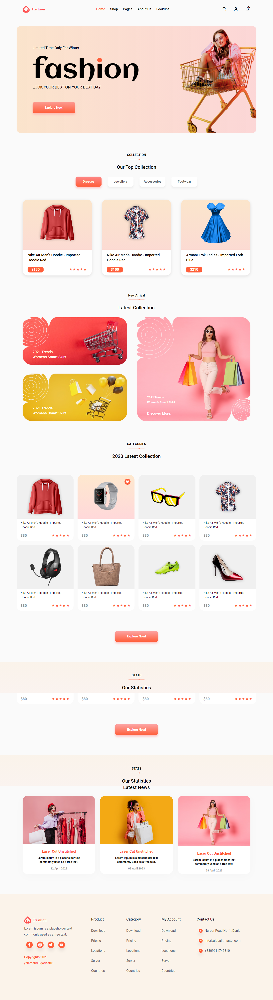

# Build a Fashion Ecommerce Website with React JS and Vanilla CSS

## Documentation

This made a landing page using React js, CSS.

## By the end of this article, I learned:

- How to set up a React JS project
- How to add product filtering with pure JavaScript
- Vanilla CSS

## Links

Live Link [Markdown Live Preview](https://globalitmasterfashion.netlify.app/).

